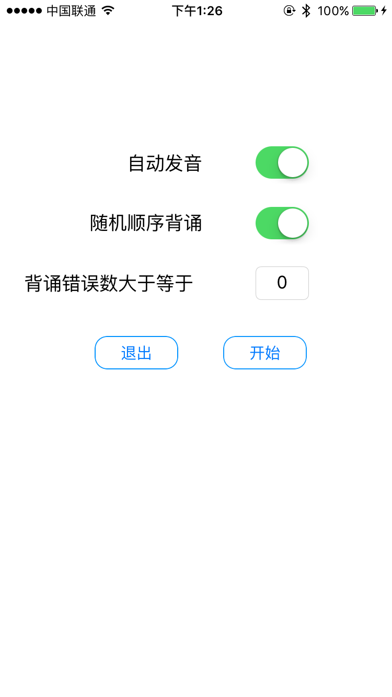

# pythonista-gre

Recite GRE vocabulary in [Pythonista](http://omz-software.com/pythonista/).

## Preview

## Menu

Choose to recite only those words whose error times exceed the threshold and randomly.